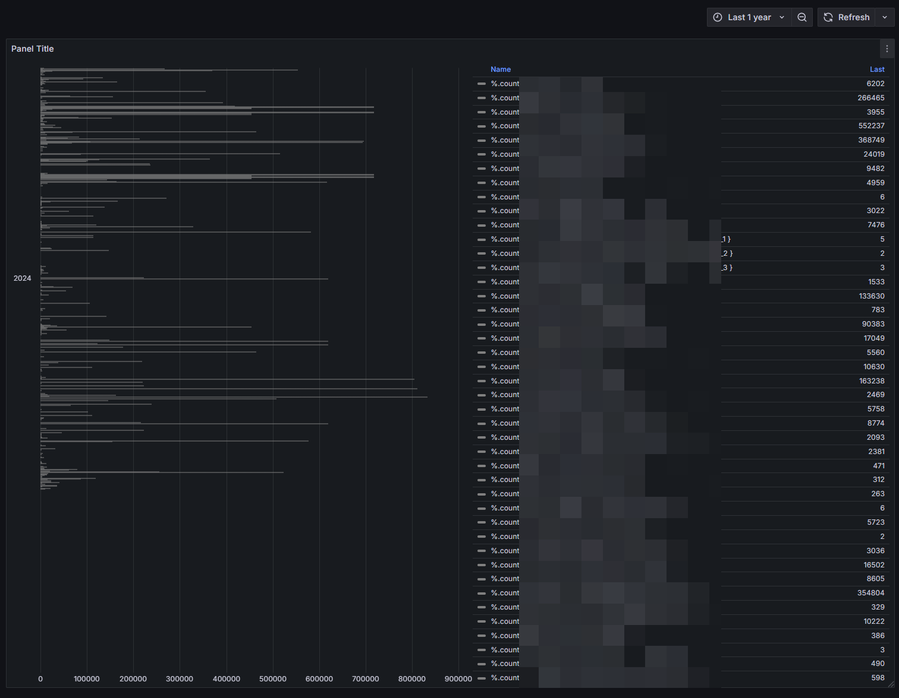

# Delete old or unwanted data from influxdb

1. Check which data points are excessive by using the [attached grafana dashboard](./delete_influxdb_data_dashboard.json):



2. Delete unwanted data data series, e.g. for a apollo_mtr_1 sensor. 

```flux
# Do it for all zones 1-3
USE "homeassistant"; DELETE FROM "mm/s" WHERE "entity_id" = 'apollo_mtr_1_cbc324_target_1_speed'
USE "homeassistant"; DELETE FROM "state" WHERE "entity_id" = 'apollo_mtr_1_cbc324_zone_1_still_target_count'
USE "homeassistant"; DELETE FROM "mm" WHERE "entity_id" = 'apollo_mtr_1_cbc324_target_1_x'
USE "homeassistant"; DELETE FROM "mm" WHERE "entity_id" = 'apollo_mtr_1_cbc324_target_1_y'
USE "homeassistant"; DELETE FROM "mm" WHERE "entity_id" = 'apollo_mtr_1_cbc324_target_1_resolution'
USE "homeassistant"; DELETE FROM "mm" WHERE "entity_id" = 'apollo_mtr_1_cbc324_target_1_distance'
USE "homeassistant"; DELETE FROM "state" WHERE "entity_id" = 'apollo_mtr_1_cbc324_zone_1_all_target_count'
USE "homeassistant"; DELETE FROM "state" WHERE "entity_id" = 'apollo_mtr_1_cbc324_zone_1_moving_target_count'
USE "homeassistant"; DELETE FROM "state" WHERE "entity_id" = 'apollo_mtr_1_cbc324_zone_1_still_target_count'
USE "homeassistant"; DELETE FROM "°" WHERE "entity_id" = 'apollo_mtr_1_cbc324_target_1_angle'

# General values
USE "homeassistant"; DELETE FROM "state" WHERE "entity_id" = 'apollo_mtr_1_cbc324_moving_target_count'
USE "homeassistant"; DELETE FROM "state" WHERE "entity_id" = 'apollo_mtr_1_cbc324_still_target_count'
USE "homeassistant"; DELETE FROM "state" WHERE "entity_id" = 'apollo_mtr_1_cbc324_presence_target_count'
USE "homeassistant"; DELETE FROM "state" WHERE "entity_id" = 'apollo_mtr_1_cbc324'
```

> From https://community.home-assistant.io/t/influxdb-is-big-how-to-manage-it/395523/30


3. You can save even more space by disabling the `_internal` database. (as it is recommended by [influx](https://docs.influxdata.com/platform/monitoring/influxdata-platform/tools/measurements-internal/))

Add to the `envvars` section of the influxdb AddOn:

```yml
- name: INFLUXDB_MONITOR_STORE_ENABLED
  value: "false"
```

Then delete the database, if it still exists:
```sql
DROP DATABASE "_internal"
```
